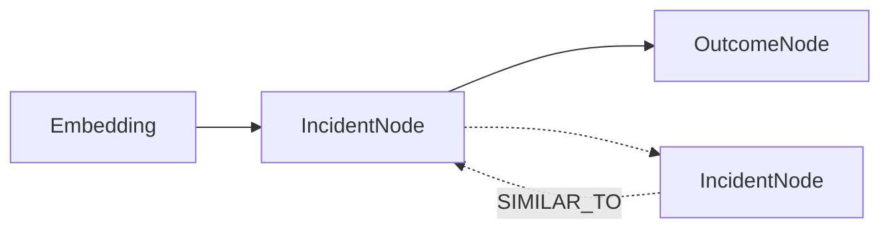

# ARF v3 – RAG Graph Schema

**Audience:** Senior Engineers, Architects, Platform Owners  
**Purpose:** Define ARF v3’s knowledge model for a queryable, learning incident memory.

---

## Design Goals

1. **Learning, not logging** – memory must influence future decisions  
2. **Separation of concerns** – vectors ≠ truth, graph = truth  
3. **Incremental adoption** – v2 compatibility preserved  
4. **Auditability** – every recommendation traceable to evidence  

---

## Conceptual Model

ARF v3 memory has **three layers**:

1. **FAISS Vector Index** – fast semantic recall  
2. **Incident Graph** – structured incident knowledge  
3. **Outcome Graph** – action effectiveness learning  



---

## Incident Node

Represents a single detected reliability incident.

### Required Fields

```python
IncidentNode = {
  "incident_id": str,              # deterministic fingerprint
  "component": str,                # e.g., payment-service
  "severity": str,                 # INFO | WARN | CRITICAL
  "timestamp": str,                # ISO-8601
  "metrics": {
    "latency_ms": float,
    "error_rate": float
  },
  "agent_analysis": dict,          # Detective + Diagnostician output
  "predictive_insights": dict,     # Forecasting agent output
  "embedding_id": int              # FAISS reference
}

```

**Notes:**

*   incident\_id is deterministic (hash of component + time window)
    
*   No free-form strings as primary fields
    
*   Raw logs stay external; graph stores reasoning artifacts
    

Outcome Node
------------

Captures **what actually happened after intervention**.
```
OutcomeNode = {
  "incident_id": str,
  "actions_taken": list[str],      # HealingAction enums
  "resolution_time_minutes": float,
  "success": bool,
  "blast_radius": str,             # single-service | multi-service
  "lessons_learned": str,
  "recorded_at": str
}
```

Rationale:

One incident may have multiple outcomes

Supports A/B action comparison

Enables postmortem replay

Graph Edges

| Edge           | From → To           | Meaning              |
| -------------- | ------------------- | -------------------- |
| SIMILAR_TO     | Incident → Incident | Semantic similarity  |
| CAUSED_BY      | Incident → Incident | Dependency failure   |
| ESCALATED_FROM | Incident → Incident | Progressive failure  |
| RESOLVED_BY    | Incident → Outcome  | Action effectiveness |


Edge Schema
```
GraphEdge = {
  "source_id": str,
  "target_id": str,
  "type": str,
  "confidence": float,
  "created_at": str
}
```

Retrieval Flow
--------------

1.  New anomaly embedded
    
2.  FAISS k-NN search (top-K)
    
3.  IncidentNodes loaded via embedding\_id
    
4.  Graph expansion (edges + outcomes)
    
5.  Context injected into Policy Engine
    

**Rule:** Policies never read FAISS directly — only the graph.

Storage Strategy
----------------

| Layer    | OSS              | Enterprise       |
| -------- | ---------------- | ---------------- |
| FAISS    | In-process       | Sharded / remote |
| Graph    | In-memory / JSON | Graph DB / KV    |
| Outcomes | Optional         | Required         |


Migration from v2
-----------------

*   Reuse existing FAISS vectors
    
*   Replace flat text metadata with IncidentNodes
    
*   Retrieval behind feature flag
    

Non-Goals
---------

*   Full observability data warehouse
    
*   Raw log storage
    
*   Real-time graph mutation at millisecond scale
    

Summary
-------

The RAG Graph is ARF’s **institutional memory**.

It enables **learning, explainability, and safer automation** — maintaining OSS integrity and performance.
