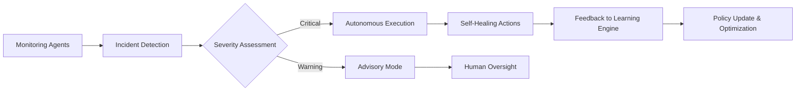

  

<h2 align="center">Enterprise Edition: Maximize System Reliability, Autonomy, and ROI</h2>

> **Tailored for mission-critical enterprises seeking 99.9%+ uptime**  
> Unlock autonomous execution, advanced learning, and compliance-grade monitoring

---

# Agentic Reliability Framework Enterprise Edition

## Overview

ARF Enterprise is designed for businesses where system reliability directly impacts revenue and customer trust. It combines multi-agent AI orchestration with advanced self-healing and anomaly detection to minimize downtime and optimize operational efficiency.

**Key Business Value:**
- Reduce incident response time by up to 80%
- Automate recovery with autonomous decision-making
- Protect revenue by mitigating downtime and service degradation
- Gain actionable insights for operational planning and forecasting

## Core Enterprise Features

### 1. Autonomous Execution
- Multi-agent decision-making framework
- Execute incident resolution without human intervention
- Safety guardrails to prevent catastrophic actions

### 2. Learning Engine
- Continuous outcome-based learning
- Feedback loop from incidents to improve predictive models
- Optimizes decision policies over time

### 3. Compliance & Auditability
- Full audit trails of all agent actions
- Integration with SSO and enterprise security policies
- Supports regulatory compliance reporting

### 4. Unlimited RAG Graph Nodes
- No limits on incident or outcome nodes
- High-volume retrieval for large enterprise environments
- Fast similarity search with FAISS optimization

### 5. Enterprise Integrations
- REST & gRPC API endpoints for internal systems
- Monitoring dashboards for executives and engineers
- Slack, Teams, or email notifications

## Enterprise ROI Calculator

| Metric | Standard | ARF Enterprise | Improvement |
|--------|----------|----------------|-------------|
| Incidents per month | 20 | 20 | 0 (same volume, faster resolution) |
| Avg response time | 45 min | 5 min | 88% reduction |
| Auto-heal rate | 0% | 70% | +70% |
| Revenue impact per incident | $1,500 | $300 | 80% savings |

### Example Financial Impact for $1M Monthly Revenue

- **Annual loss without ARF:** $360,000
- **Annual loss protected with ARF:** $72,000
- **Net savings:** $288,000
- **Payback period:** ~2 months

## Enterprise Architecture Diagram

## Deployment & Integration

- Containerized deployment (Docker, Kubernetes)
- Cloud-agnostic: AWS, GCP, Azure
- Integration with CI/CD pipelines for proactive monitoring
- Enterprise SLA support and 24/7 assistance

## Customer Testimonials

> "ARF Enterprise transformed our incident response, reducing downtime and revenue loss drastically." – CTO, Fortune 500

> "The autonomous self-healing engine is a game-changer. Our engineers can focus on innovation rather than firefighting." – VP Engineering

## Get Started

- Schedule an enterprise demo: [https://arf.dev/enterprise-demo](https://arf.dev/enterprise-demo)
- Contact our sales team: [sales@arf.dev](mailto:sales@arf.dev)
- Access documentation and onboarding guide: [Docs](https://github.com/petterjuan/agentic-reliability-enterprise/tree/main/docs)

---

**ARF Enterprise** – Empowering executives, engineers, and investors with unparalleled operational reliability and ROI.

